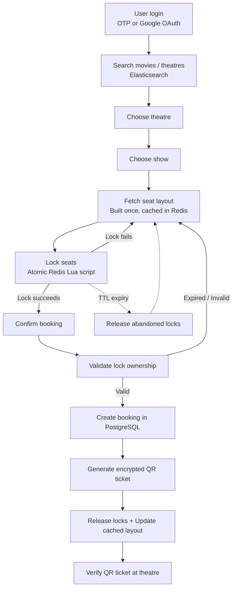

# CineBook — Movie Ticket Booking Backend

A production-style movie ticket booking backend built with **FastAPI**. The project focuses on the parts of a booking system that become challenging at scale rather than the CRUD around movies and theatres. It implements passwordless authentication, concurrency-safe seat booking, role-based administration, encrypted QR-code ticket verification, full-text search, and asynchronous request handling throughout the stack.

The architecture is inspired by how modern ticket booking platforms solve shared-resource problems: an in-memory locking layer handles high-contention seat selection, while PostgreSQL remains the durable source of truth. The goal is not to replicate any existing platform, but to explore the engineering trade-offs involved in building systems with similar requirements.

---

# Why This Project Exists

CineBook was built as the second project in a structured backend engineering journey, where each project intentionally introduces a new class of production problems.

The first project, **FlowBoard**, focused on the fundamentals of modern backend development: authentication, asynchronous programming, distributed task processing, automated testing, Docker, and cloud deployment. It established the foundation for building production-ready services.

CineBook builds on that foundation by exploring problems that go beyond CRUD. In a ticket booking system, correctness depends on much more than database queries. When many users compete for the same seat simultaneously, concurrency control, transaction boundaries, distributed locking, and consistency become the primary challenges.

The project was designed to understand how these systems work behind the scenes by implementing and evaluating real engineering solutions rather than simplified demonstrations.

The major areas explored include:

* High-concurrency seat booking and race-condition handling
* Distributed locking with Redis and Lua scripting
* Transaction management across Redis and PostgreSQL
* Role-based access control for multiple user types
* Theatre, screen, and show management
* Encrypted QR ticket generation and verification
* Search system design using multiple approaches
* Performance analysis through concurrent load testing

Every major design decision was made by balancing correctness, scalability, maintainability, and performance. For example, search was implemented using SQL queries, PostgreSQL Full-Text Search, and Elasticsearch before selecting the solution that provided the best overall search experience. Once the booking system was complete, Locust was used to validate its behaviour under concurrent load and verify that the booking workflow remained correct even when many users attempted to reserve the same seats simultaneously.

---

# Project Overview

CineBook exposes a versioned REST API (`/api/v1`) for three different types of users.

End users can browse movies and theatres, search available shows, temporarily hold seats, complete bookings, receive encrypted QR tickets, and manage their bookings.

Theatre administrators manage their own theatres by designing seat layouts, creating screens, scheduling shows, and verifying customer tickets at the theatre gate.

Platform administrators manage users, theatres, and movies, including importing movie metadata and maintaining the platform catalogue.

## User Roles

| Role              | Responsibilities                                                                                               |
| ----------------- | -------------------------------------------------------------------------------------------------------------- |
| `user`          | Browse movies and theatres, search shows, lock and book seats, receive QR tickets, manage bookings and profile |
| `theatre_admin` | Create seat layouts, manage screens, schedule shows, verify customer QR tickets, manage owned theatres         |
| `admin`         | Manage users, theatres, movies, and platform-wide catalogue operations                                         |

## Booking Workflow

The booking lifecycle is designed to prevent multiple users from purchasing the same seat.

A user authenticates using email OTP or Google OAuth, searches for a movie, selects a show, and requests its seat layout. When seats are selected, they are temporarily locked in Redis to prevent concurrent users from reserving them during checkout. When the booking is confirmed, the backend verifies ownership of those locks, writes the booking transaction to PostgreSQL, generates an encrypted QR ticket, updates the cached seat layout, and releases the temporary locks.

If the booking is abandoned, the locks expire automatically after their configured TTL, making the seats available again without requiring any background cleanup process.

The implementation details behind this workflow are explained later in the **Complete Booking Flow** and **Seat Locking** sections.

---

# Highlights

| Capability                            | Description                                                                                      |
| ------------------------------------- | ------------------------------------------------------------------------------------------------ |
| **Passwordless Authentication** | Email + OTP login and Google OAuth 2.0 with JWT access and refresh tokens                        |
| **Role-Based Authorization**    | Three user roles (`user`, `theatre_admin`, `admin`) with permission-based route protection |
| **Concurrency-Safe Booking**    | Atomic Redis Lua scripts prevent seat double-booking under concurrent requests                   |
| **Encrypted QR Tickets**        | Bookings generate encrypted QR codes that can be verified by theatre staff                       |
| **Full-Text Search**            | Elasticsearch-powered search with prefix matching and relevance ranking                          |
| **Theatre Management**          | Seat layout design, screen management, and show scheduling                                       |
| **Fully Asynchronous Stack**    | Async FastAPI, SQLAlchemy, Redis, and Elasticsearch clients throughout                           |
| **Production Middleware**       | Global exception handling and token-bucket rate limiting                                         |

---

# Tech Stack

| Component                           | Technology                                       |
| ----------------------------------- | ------------------------------------------------ |
| **Framework**                 | FastAPI (Python 3.12)                            |
| **Database**                  | PostgreSQL 16 + SQLAlchemy 2.0 (Async) + asyncpg |
| **Migrations**                | Alembic                                          |
| **Cache & Distributed Locks** | Redis (Redis Stack)                              |
| **Search Engine**             | Elasticsearch 9                                  |
| **Package Manager**           | `uv`                                           |
| **Containerization**          | Docker & Docker Compose                          |
| **Load Testing**              | Locust                                           |
| **Testing**                   | Pytest + Coverage                                |

---

# Architecture

CineBook follows a layered architecture where each layer has a single responsibility. Requests always flow from the API layer down to the persistence layer, keeping business logic, database access, validation, and infrastructure concerns separate.

This separation makes the codebase easier to extend and maintain. New business rules belong in services, database queries stay inside repositories, validation lives in schemas, and routing remains focused on HTTP concerns.

```text
        HTTP Request
             │
   ┌─────────▼─────────┐
   │      Routes       │  app/api/v1/*
   ├───────────────────┤
   │   Dependencies    │  app/api/dependencies.py
   ├───────────────────┤
   │     Services      │  app/services/*
   ├───────────────────┤
   │   Repositories    │  app/repositories/*
   ├───────────────────┤
   │      Models       │  app/models/*
   └─────────┬─────────┘
             │
 PostgreSQL │ Redis │ Elasticsearch
```

## Layer Responsibilities

### Routes (`app/api/v1/*`)

Routes define HTTP endpoints, validate incoming requests through Pydantic schemas, and delegate work to the service layer. They never contain business logic or database queries.

### Dependencies (`app/api/dependencies.py`)

Dependencies wire together repositories and services using FastAPI's dependency injection system. Authentication, authorization, and shared request-scoped objects are also configured here.

### Services (`app/services/*`)

Services implement the application's business logic. They coordinate repositories, Redis, and Elasticsearch, enforce business rules, and define transaction boundaries.

### Repositories (`app/repositories/*`)

Repositories contain every SQLAlchemy query in the project. Centralizing database access keeps services independent of persistence details and makes queries easier to audit and maintain.

### Schemas (`app/schemas/*`)

Pydantic schemas validate request data and serialize responses. Shared response models ensure every endpoint returns a consistent API format.

### Models (`app/models/*`)

SQLAlchemy declarative models define the relational schema stored in PostgreSQL.

### Middleware (`app/middlewares/*`)

Middleware handles cross-cutting concerns applied to every request, including global exception handling and token-bucket rate limiting.

---

## Why Multiple Datastores?

Each datastore is responsible for a specific type of workload rather than trying to solve every problem.

### PostgreSQL

The system's **source of truth**.

It stores all durable business data, including users, theatres, movies, shows, bookings, and booked seats. Every confirmed booking is committed here inside a database transaction.

### Redis

The **high-speed in-memory layer**.

Redis stores temporary data such as OTPs, cached seat layouts, and seat locks. Because these operations are short-lived and highly concurrent, keeping them in memory significantly reduces latency while preventing contention on the database.

### Elasticsearch

The **search engine**.

Movies and theatres are indexed separately from PostgreSQL to provide fast full-text and prefix search without placing search load on the transactional database.

Each datastore is used for the workload it is best suited for, resulting in a simpler and more scalable architecture.

---

# Complete Booking Flow

The booking workflow is the core of CineBook. It combines Redis and PostgreSQL to provide a booking experience that is both responsive and correct under concurrent access. Redis manages temporary seat reservations during checkout, while PostgreSQL remains the authoritative record of every confirmed booking.



## Booking Lifecycle

### 1. Authentication

Users authenticate using either email OTP or Google OAuth and receive JWT access and refresh tokens.

### 2. Search

Movies and theatres are searched through Elasticsearch, allowing users to quickly locate a theatre and an available show.

### 3. Select a Show

The user navigates to a specific show and requests its seat layout.

### 4. Load Seat Layout

The seat layout is built from PostgreSQL the first time it is requested and cached in Redis. Subsequent requests are served directly from the cache, avoiding repeated database queries.

### 5. Lock Seats

When seats are selected, an atomic Redis Lua script attempts to lock every requested seat.

The operation follows an **all-or-nothing** approach:

* If every requested seat is available, all are locked.
* If even one seat is already locked, no locks are created.

This prevents partial reservations and eliminates race conditions during seat selection.

### 6. Validate Lock Ownership

Before confirming the booking, the backend verifies that the requesting user still owns every seat lock.

Bookings are rejected if:

* the locks have expired, or
* another user owns any of the requested seats.

### 7. Confirm the Booking

Once ownership has been verified, the booking is created inside a single PostgreSQL transaction.

The transaction writes:

* the booking record
* booked seats
* payment-related information (if applicable)

PostgreSQL performs the final integrity check. Even if two requests somehow reach this stage simultaneously, database constraints ensure only one can succeed.

### 8. Generate the Ticket

After a successful booking, the backend generates an encrypted ticket, converts it into a QR code, and emails it to the customer using a background task.

### 9. Update Cached State

The temporary seat locks are removed and the cached seat layout is updated so future users immediately see the newly booked seats.

### 10. Ticket Verification

At the theatre, a `theatre_admin` scans the QR code. The backend decrypts the ticket, validates its authenticity, and verifies that the booking is still valid.

### 11. Automatic Lock Expiry

If a customer abandons the checkout process, Redis automatically removes the seat locks after their configured TTL.

No background scheduler or cleanup job is required, and the seats immediately become available for other users.

---

# Seat Locking: Solving the Concurrency Problem

Preventing two users from booking the same seat is the most challenging part of the system. While the rest of the application largely consists of standard CRUD operations, booking introduces a shared, finite resource that many users may attempt to reserve simultaneously.

## The Problem

A booking is not completed instantly.

A typical user:

1. Opens the seat layout.
2. Selects one or more seats.
3. Reviews the booking.
4. Confirms the purchase.

This process may take several seconds.

During that time, another user can view the same seat layout and attempt to reserve the exact same seats. Without proper coordination, both users may believe the seats are available, creating a classic **check-then-act race condition**.

```text
User A                     User B

Reads A10 (Free)           Reads A10 (Free)

        ↓                        ↓

Attempts booking          Attempts booking

        ↓                        ↓

Without coordination,
both requests may succeed.
```

The system therefore needs a way to temporarily reserve seats while a customer completes checkout.

---

## Why Not Use Database Transactions?

A common first idea is to rely entirely on PostgreSQL transactions.

While database transactions guarantee consistency **when a booking is committed**, they are not designed to reserve seats while a user is deciding whether to complete the purchase.

Keeping a transaction open for the entire checkout process would mean holding database locks for several seconds while users think, review payment details, or abandon the checkout altogether.

This approach introduces several problems:

* Long-running transactions consume database connections.
* Row locks reduce concurrency under heavy traffic.
* Abandoned checkouts leave locks open until the transaction ends.
* The database becomes responsible for temporary state instead of durable data.

The database is the right place to **finalize a booking**, but not to **hold an intention to book**.

---

## Why Redis?

Seat holds have three characteristics:

* temporary
* short-lived
* highly concurrent

Redis is designed for exactly this type of workload.

It provides:

* in-memory performance
* atomic operations
* automatic expiration through TTL
* extremely low latency under heavy contention

This allows PostgreSQL to focus solely on confirmed bookings while Redis manages temporary reservations during checkout.

---

## Why Use a Lua Script?

Locking multiple seats must be treated as a single operation.

Imagine a user selecting three seats:

```text
A10
A11
A12
```

If each seat were locked independently:

```text
Lock A10 ✓

Lock A11 ✓

A12 already locked ✗
```

The customer would end up holding only part of the requested reservation.

Instead, CineBook follows an **all-or-nothing** approach.

Either:

```text
A10 ✓
A11 ✓
A12 ✓
```

or

```text
Nothing is locked.
```

To guarantee this behaviour, Redis executes a Lua script atomically.

The script:

1. Checks that every requested seat is available.
2. If any seat is already locked, the operation immediately fails.
3. Otherwise, all requested seats are locked.
4. A TTL is assigned so the reservation expires automatically if abandoned.

Because Redis executes Lua scripts atomically, no other client can modify the lock state while the script is running.

A simplified version of the script is shown below:

```lua
-- KEYS[1] = show_seat_locked_<show_id>
-- ARGV = user_id, expiry, seat_ids...

for i = 3, #ARGV do
    if redis.call("HEXISTS", lock_key, ARGV[i]) == 1 then
        return 0
    end
end

for i = 3, #ARGV do
    redis.call("HSET", lock_key, ARGV[i], user_id)
end

redis.call("EXPIRE", lock_key, expiry)

return 1
```

The entire operation completes inside Redis as a single atomic command.

---

## Automatic Lock Expiry

Seat locks are temporary.

Each lock is assigned a TTL (currently **10 minutes**).

If a customer closes the browser, loses their connection, or abandons the checkout process, Redis automatically removes the lock when the TTL expires.

```text
User selects seats

↓

Seats locked

↓

User leaves

↓

TTL expires

↓

Redis removes locks

↓

Seats become available again
```

No scheduled cleanup job is required.

---

## The Final Safety Net

Redis prevents most booking conflicts before they reach the database, but PostgreSQL still performs the final validation.

When a booking is confirmed, the booking and booked seats are written inside a single transaction.

A partial unique index ensures that two confirmed bookings can never exist for the same seat, even if two requests somehow bypass the locking stage.

This gives the system two independent layers of protection:

```text
Redis
↓

Prevents concurrent seat selection.

↓

PostgreSQL
↓

Guarantees permanent booking integrity.
```

Redis optimizes the booking workflow, while PostgreSQL guarantees correctness.

---

## Why This Design?

Each component is responsible for the task it performs best.

| Component            | Responsibility                                                |
| -------------------- | ------------------------------------------------------------- |
| **Redis**      | Temporary seat reservations, atomic locking, automatic expiry |
| **PostgreSQL** | Durable booking records and transactional consistency         |

Separating temporary state from permanent state keeps the booking path responsive while ensuring that confirmed bookings remain correct, even under heavy concurrent load.

---

# Search

Movie and theatre search is powered by **Elasticsearch**, but arriving at that choice involved evaluating simpler alternatives first.

## Evaluating the Options

### 1. SQL `LIKE` Queries

The simplest implementation uses pattern matching:

```sql
WHERE name ILIKE '%query%'
```

While easy to implement, this approach performs poorly as the dataset grows.

It has several limitations:

* Leading wildcards prevent efficient index usage.
* Searches often require full table scans.
* Results are not relevance-ranked.
* No tolerance for partial matches or typographical errors.

For small datasets this is acceptable, but it does not provide the experience users expect from a production search system.

---

### 2. PostgreSQL Full-Text Search

The next approach was PostgreSQL Full-Text Search (`tsvector` / `tsquery`).

Compared to `LIKE` queries, it offers significant improvements:

* Proper indexing with GIN indexes.
* Tokenization and stemming.
* Relevance ranking.
* Everything remains inside PostgreSQL.

For many applications, PostgreSQL Full-Text Search is an excellent solution and would have been sufficient for this project.

---

### 3. Elasticsearch

The final implementation uses Elasticsearch because it provides a richer search experience while keeping search traffic independent of the transactional database.

Some of the capabilities that influenced this decision include:

* Fast full-text search
* Prefix and type-ahead matching (`match_phrase_prefix`)
* Relevance-based result ranking
* Independent scaling from PostgreSQL

Separating search from the primary database also prevents heavy search traffic from competing with booking operations.

The trade-off is the additional complexity of maintaining a second datastore, which was an intentional design decision to better understand production search architectures.

---

## Keeping Elasticsearch in Sync

PostgreSQL remains the source of truth.

Elasticsearch stores a lightweight searchable representation containing fields such as:

* Name
* Entity type
* Database ID

Whenever a movie or theatre is created, updated, or hidden, a background task updates the corresponding Elasticsearch document.

If the search index ever needs rebuilding, a dedicated migration script can recreate it directly from PostgreSQL.

Because synchronization runs as a post-response background task, indexing never increases the latency of user-facing write operations.

---

## Benefits

Using Elasticsearch provides several practical advantages:

* Fast full-text and prefix search
* Relevance-ranked results
* Search traffic isolated from transactional workloads
* Independent scaling of search infrastructure
* Search failures do not affect booking operations

This separation allows PostgreSQL to focus on transactional consistency while Elasticsearch is optimized exclusively for search.

---

# Features

## Authentication

* Passwordless authentication using Email + OTP
* Google OAuth 2.0 sign-in
* JWT access and refresh tokens
* Redis-backed OTP storage with automatic expiry

---

## Authorization

* Three user roles: `user`, `theatre_admin`, and `admin`
* Permission-based route protection
* Resource ownership validation for theatre administrators

---

## Booking Engine

* Two-phase **Lock → Book** workflow
* Atomic Redis Lua script for seat locking
* Transactional booking with PostgreSQL
* Database-level protection against double bookings
* Booking history and cancellation support

---

## Search

* Elasticsearch-powered full-text search
* Prefix (type-ahead) search
* Automatic background index synchronization

---

## Caching

* Redis-cached seat layouts
* Incremental cache updates after bookings and cancellations

---

## QR Ticketing

* Encrypted QR code generation
* Email delivery using background tasks
* Ticket verification for theatre staff

---

## Theatre Management

* Seat layout designer
* Screen management
* Show scheduling
* Show timing and overlap validation

---

## Platform Administration

* User, theatre, and movie management
* Movie import via OMDb API
* Paginated catalogue endpoints
* Soft-delete support

---

# Performance & Load Testing

The booking engine, application latency, and rate limiter were validated using **Locust** under concurrent load to verify both correctness and performance.

Three workloads were implemented:

| User Class          | Purpose                                                                                 |
| ------------------- | --------------------------------------------------------------------------------------- |
| `FullAppUser`     | Measures overall application latency across common read-only endpoints                  |
| `SeatBookingUser` | Simulates concurrent users competing for the same seats to validate booking correctness |
| `RateLimitUser`   | Verifies the token-bucket rate limiter under sustained request floods                   |

The tests confirmed:

* No double-booked seats under concurrent booking attempts.
* Stable application latency for normal read workloads.
* Correct throttling by the rate limiter under heavy traffic.
* Identification of a CPU-bound bottleneck caused by repeated PBKDF2 key derivation during booking.

Detailed setup instructions, benchmark reports, and reproducible test scenarios are available in **[`loadtest/README.md`](./loadtest/README.md)**.

---

# Getting Started

## Prerequisites

* Python 3.12
* `uv`
* PostgreSQL
* Redis
* Elasticsearch

If these services are not installed locally, you can start them using Docker Compose:

```bash
docker compose up db redis elasticsearch -d
```

## Installation

Clone the repository and install dependencies:

```bash
git clone https://github.com/Jaymin4724/cinebook.git
cd cinebook

uv sync
```

Copy the environment template:

```bash
cp .env.example .env
```

Update the required values in `.env`, including:

* Database connection (`DB_URL`, `TEST_DB_URL`)
* Redis configuration
* Elasticsearch URL
* JWT secrets
* Mail credentials (for OTP emails)
* Google OAuth credentials (optional)
* OMDb API key
* Encryption password and salt

> Never commit real secrets or your `.env` file.

## Database Setup

Apply migrations:

```bash
uv run alembic upgrade head
```

Before seeding, update the admin and theatre admin email addresses inside:

```text
app/scripts/seed_db.py
```

Then seed the database:

```bash
uv run python -m app.scripts.seed_db
```

## Run the Application

```bash
uv run fastapi dev app/main.py
```

Useful endpoints:

| URL         | Description  |
| ----------- | ------------ |
| `/docs`   | Swagger UI   |
| `/redoc`  | ReDoc        |
| `/health` | Health check |

Frequently used development commands are also available in the project's `Makefile`.

---

# Testing

The project includes both unit and integration tests covering authentication, authorization, theatre management, booking, and user workflows.

Highlights:

* Async test suite using Pytest
* Dedicated PostgreSQL test database
* In-memory fake Redis
* Rate limiter disabled during testing

Run the test suite:

```bash
uv run pytest

uv run pytest --cov=app
```

**Current test coverage:** **82%**

---

# API Overview

All endpoints are versioned under `/api/v1`.

Interactive documentation is available at:

* `/docs` (Swagger UI)
* `/redoc` (ReDoc)

### Authentication

| Method | Endpoint                  | Description                     |
| ------ | ------------------------- | ------------------------------- |
| POST   | `/auth/send-otp`        | Send login OTP                  |
| POST   | `/auth/signin`          | Verify OTP and issue JWT tokens |
| GET    | `/auth/google/login`    | Google OAuth login              |
| GET    | `/auth/google/callback` | Google OAuth callback           |

### User

| Method | Endpoint                           | Description                  |
| ------ | ---------------------------------- | ---------------------------- |
| GET    | `/users/theatre/{id}/movies`     | Movies in a theatre          |
| GET    | `/users/movie/{id}/theatres`     | Theatres showing a movie     |
| GET    | `/users/theatre/{id}/movie/{id}` | Shows for a movie            |
| GET    | `/users/show/{id}`               | Show details and seat layout |
| POST   | `/users/show/{id}/seat-lock`     | Lock seats                   |
| POST   | `/users/show/{id}/seat-book`     | Confirm booking              |
| GET    | `/users/me`                      | User profile                 |
| PATCH  | `/users/me`                      | Update profile               |
| GET    | `/users/bookings`                | Booking history              |
| GET    | `/users/bookings/{id}`           | Booking details              |
| POST   | `/users/bookings/{id}/cancel`    | Cancel booking               |
| DELETE | `/users/user/delete`             | Delete account               |

### Admin

| Method | Endpoint                                                 | Description    |
| ------ | -------------------------------------------------------- | -------------- |
| POST   | `/admin/create-user`                                   | Create user    |
| POST   | `/admin/create-theatre`                                | Create theatre |
| POST   | `/admin/create-movie`                                  | Import movie   |
| GET    | `/admin/users`, `/admin/theatres`, `/admin/movies` | List resources |
| DELETE | Theatre/Movie delete endpoints                           | Soft delete    |

### Theatre Admin

| Method | Endpoint                             | Description        |
| ------ | ------------------------------------ | ------------------ |
| POST   | `/theatre-admin/create-layout`     | Create seat layout |
| POST   | `/theatre-admin/create-screen`     | Create screen      |
| POST   | `/theatre-admin/create-show`       | Schedule show      |
| GET    | Theatre and screen listing endpoints | Owned resources    |
| DELETE | Screen and show delete endpoints     | Soft delete        |
| POST   | `/theatre-admin/verify-ticket`     | Verify QR ticket   |

### Search

| Method | Endpoint    | Description                |
| ------ | ----------- | -------------------------- |
| GET    | `/search` | Search movies and theatres |

### System

| Method | Endpoint    | Description  |
| ------ | ----------- | ------------ |
| GET    | `/health` | Health check |

---

# Project Structure

```text
cinebook/
├── app/
│   ├── api/
│   ├── core/
│   ├── db/
│   ├── middlewares/
│   ├── models/
│   ├── repositories/
│   ├── schemas/
│   ├── services/
│   ├── scripts/
│   ├── utils/
│   └── main.py
├── alembic/
├── tests/
├── loadtest/
├── docker-compose.yaml
├── Dockerfile
├── Makefile
└── pyproject.toml
```

See **`CLAUDE.md`** for a detailed guide to the codebase.

---

# Scalability Considerations

Although currently deployed as a single application, the architecture supports future scaling through:

* Horizontal API scaling behind a load balancer
* Redis clustering
* Message queues for asynchronous processing
* Event-driven integrations
* PostgreSQL read replicas
* Dedicated payment and notification services
* API Gateway and CDN integration

---

# Future Work

Planned improvements include:

* Payment gateway integration
* Refund workflow
* Enhanced cancellation policies
* Distributed background workers
* Monitoring, tracing, and observability
